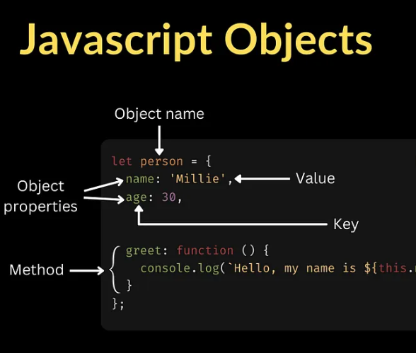

# exercicios
- [001-alert](/ex/001-alert/index.html) popup-alert
- [002-interactive-system](ex/002-interactive-system/index.html) interactive-system
- [004-calculator](ex/004-calculator/index.html) calculator
- [005-digital-wallet](ex/005-digital-wallet/index.html) digital-wallet

- [003-adding-values](ex/003-adding-values/index.html) adding-values

## GIT FLOW

> git status

conferir se tem um arquivo pendente p commitar

> git checkout develop

todo branch novo deve ser criado a partir da develop

> git pull origin develop

trazer as ultimas mudancas do servidor pro local

> git checkout -b ex/001-soma-de-arrays

cria um branch novo pra trabalhar no exercicio 

- copia a pasta template para dentro da pasta ex
- renomeia a nova pasta para o mesmo numero e nome do branch
- edita o readme com o link do index do exercicio, e um texto descritivo sobre o exercicio
- edita o index main e coloca o link pro html do exercicio
- terminou o exercicio

> git status

conferir se esta no branch certo ex/00#-nome
NAO ALTERAR ARQUIVOS NA PASTA TEMPLATE!!!!!!!!

> git add .

adiciona os arquivos mudados no commit 

> git commit -m "nome-do-commit"

commitar

> git push origin ex/00#-nome

envia as novas mudancas e o novo branch pro servidor

- acessar o github
- abrir um novo pull request da branch pra DEVELOP
- colocar os mentores como reviws
- so mergear apos uma revisao

#### Javascript objects

https://developer.mozilla.org/pt-BR/docs/Web/JavaScript/Guide/Working_with_objects

## anotacao 

- se eu ja criei 
"historico": []
e quero adicionar informacoes dentro dele, eu preciso por push!
tipo, por data, e outras coisas

## why use eval is a problem? 
Using eval() in JavaScript is generally considered bad practice because it introduces security, performance, and maintainability problems.

Here’s why:

1. Security Risks (Code Injection)
eval() executes any string as JavaScript code.
If that string contains user-provided input, attackers can inject malicious code.
Example of a dangerous case:
Javascript

Copy code
const userInput = "alert('Hacked!')";
eval(userInput); // Executes arbitrary code
This can lead to XSS (Cross-Site Scripting) attacks in browsers or remote code execution in Node.js.
2. Performance Issues
JavaScript engines cannot optimize code inside eval() effectively because the code is determined at runtime.
This forces the engine to recompile and deoptimize execution, making it slower.
3. Debugging and Maintainability Problems
Code inside eval() is harder to read, debug, and maintain.
Static analysis tools (like ESLint) can’t easily detect errors inside eval() strings.
Refactoring becomes risky because the code is hidden inside strings.
